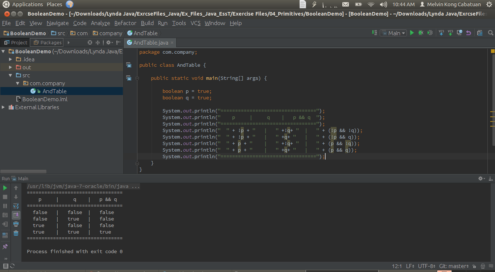

# BooleanDemo

TruthTableDemo

## First version



## Second version (Added OR and XOR)


## Output:

```shell
/usr/lib/jvm/java-7-oracle/bin/java -Didea.launcher.port=7537 -Didea.launcher.bin.path=/home/cobalt/idea-IC-143.1821.5/bin -Dfile.encoding=UTF-8 -classpath /usr/lib/jvm/java-7-oracle/jre/lib/jfxrt.jar:/usr/lib/jvm/java-7-oracle/jre/lib/plugin.jar:/usr/lib/jvm/java-7-oracle/jre/lib/javaws.jar:/usr/lib/jvm/java-7-oracle/jre/lib/charsets.jar:/usr/lib/jvm/java-7-oracle/jre/lib/deploy.jar:/usr/lib/jvm/java-7-oracle/jre/lib/rt.jar:/usr/lib/jvm/java-7-oracle/jre/lib/jfr.jar:/usr/lib/jvm/java-7-oracle/jre/lib/resources.jar:/usr/lib/jvm/java-7-oracle/jre/lib/jce.jar:/usr/lib/jvm/java-7-oracle/jre/lib/management-agent.jar:/usr/lib/jvm/java-7-oracle/jre/lib/jsse.jar:/usr/lib/jvm/java-7-oracle/jre/lib/ext/dnsns.jar:/usr/lib/jvm/java-7-oracle/jre/lib/ext/sunjce_provider.jar:/usr/lib/jvm/java-7-oracle/jre/lib/ext/zipfs.jar:/usr/lib/jvm/java-7-oracle/jre/lib/ext/localedata.jar:/usr/lib/jvm/java-7-oracle/jre/lib/ext/sunpkcs11.jar:/usr/lib/jvm/java-7-oracle/jre/lib/ext/sunec.jar:/home/cobalt/IdeaProjects/BooleanDemo/out/production/BooleanDemo:/home/cobalt/idea-IC-143.1821.5/lib/idea_rt.jar com.intellij.rt.execution.application.AppMain ph.edu.dlsu.objectp.Main
 AND TRUTH TABLE: 
=================================
    p     |     q    |   p && q  
=================================
  false   |   false  |   false
  false   |   true   |   false
  true    |   false  |   false
  true    |   true   |   true
=================================

 OR TRUTH TABLE: 
=================================
    p     |     q    |   p || q  
=================================
  false   |   false  |   false
  false   |   true   |   true
  true    |   false  |   true
  true    |   true   |   true
=================================

 XOR TRUTH TABLE: 
=================================
    p     |     q    |   p XOR q  
=================================
  false   |   false  |   false
  false   |   true   |   true
  true    |   false  |   true
  true    |   true   |   false
=================================

Process finished with exit code 0
```
